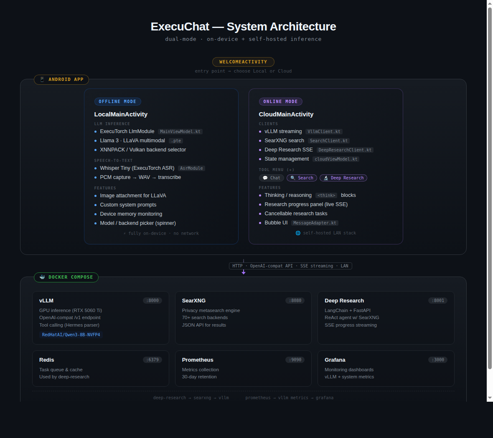
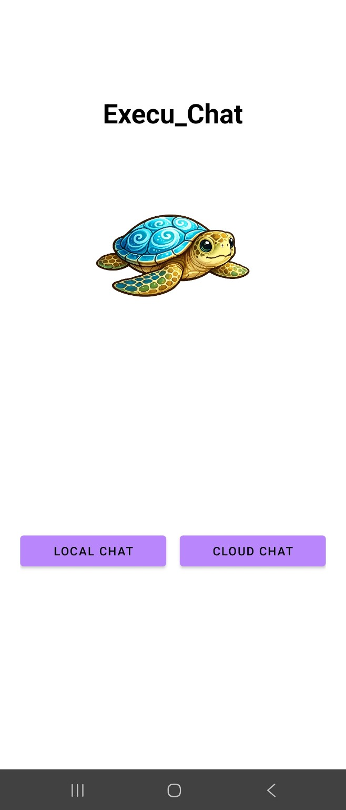

# ExecuChat

A dual-mode Android AI assistant that runs **fully offline** with on-device inference via ExecuTorch, 
or **online** through a self-hosted vLLM server with web search and deep research capabilities.

<h3>Architecture Overview</h3>

<table>
  <tr>
    <td align="center">
      
      <br/>
      <strong>Fig. 1.</strong> ExecuChat system architecture 
    </td>
    <td align="center">
      
      <br/>
      <strong>Fig. 2.</strong> App welcome screen 
    </td>
  </tr>
</table>

### Offline Mode

On-device LLM inference — nothing leaves the phone.

- Run Executorch program on phone- llama, qwen, llava, etc
- Has internal kv_cache management (remembers)
- Whisper speech-to-text (asr)
- Image Q&A with multimodal models (LLaVA)
- XNNPACK and Vulkan backend options
- Custom system prompts, generation stats, memory monitoring

> 📖 [Why ExecuTorch, model export, backends & benchmarks →](docs/offline.md)
> 

### Offline Demo - LLama3B Vulkan (chat)
<video src="/home/julien/Documents/JVarnica.github.io/videos/llama3B_vulkan.mp4" width="320" controls></video>

### Online Mode

Cloud-powered inference via self-hosted docker stack with vLLM for model inference, the app is made
using FastAPI with jwt token for user authentication. There are 9 containers

- **vLLM** serve hf models on gpu, OpenAI-API
- **searcXNG** privacy metasearch engine, JSON API
- **Auth** as seperate fast a
- **Prometheus** for live metric collection
- **gratana** for monitoring dashboards
- **Redis** Task queue & caching for research agent

> For more information about the configuration and running the server look at the repo, [python-server](https://github.com/JVarnica/vllm-server)

> For more information about the research agent look at repo, [research-agent](https://github.com/JVarnica/research-agent)

### Online Demo - Qwen3-8B (chat
<video src="/home/julien/Documents/JVarnica.github.io/videos/chat_comp_rtx.mp4" width="320" controls></video>

## Prerequisites

- This setup is with Linux Ubuntu 24
- Android device with 8gb+ RAM (12+gb to run Llava) OFFLINE MODE
- NVIDIA GPU with 16GB+ VRAM ONLINE MODE
- Docker & Docker Compose
- Android Studio (build & Install app)

## Quick Start

### Offline Mode

1. You want a model in pte format. So either clone the executorch repository or use python library to export it.
2. download the executorch aar for mobile
3. Clone this repo
4. Load this on Android-studio

### Online Mode

1. Start the backend — see the [server repo](https://github.com/JVarnica/vllm-server).
```bash
   docker compose up -d
```
2. In the app, switch to **Cloud mode** and point it at your server address.
3. Register / log in — the app handles JWT issue and silent refresh automatically.
4. Use streaming chat, web search, and the research agent.

## Tech Stack

**Android (this repo)** — Kotlin, ExecuTorch (Vulkan / XNNPACK), Whisper, LLaVA, OkHttp, JWT client with silent refresh
**Backend** — FastAPI, vLLM, Redis, Redis Streams, Qdrant, SearxNG, LangGraph, async SQLite, Docker Compose, Prometheus, Grafana

## Related Repositories
 
| Component | Repo |
|---|---|
| Android app (this repo) | [Execu_Chat](https://github.com/JVarnica/Execu_Chat) & [Hub](https://jvarnica.github.io/_projects/execuchat/)
| Backend server | [vllm-server](https://github.com/JVarnica/vllm-server) & [server hub](https://jvarnica.github.io/_projects/python-server/)
| Deep research agent | [research-agent](https://github.com/JVarnica/research-agent) & [research-agent](https://jvarnica.github.io/_projects/research-agent/)


